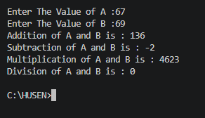
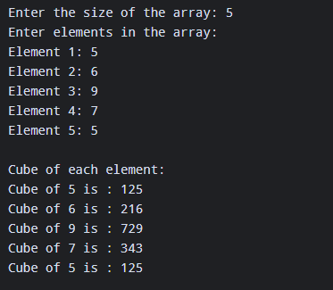
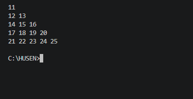
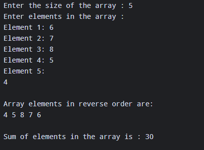
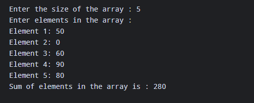

# 🧮 C Programming Practical Exam

A collection of **C programming practical exam programs** covering fundamental concepts such as functions, arrays, loops, conditional statements, patterns, and basic arithmetic operations.

This repository contains simple and beginner-friendly C programs written as part of my **C Programming Practical Exam**.

## 📌 Repository

**C-PRACTICAL-EXAM**

---

## 📚 Practical Programs

| No. | Program                                    | File                |
| --- | ------------------------------------------ | ------------------- |
| 1   | 🧮 Calculator using User Defined Functions | `calculator.c`      |
| 2   | 🔢 Cube of Elements in 1D Array            | `cube-1d-array.c`   |
| 3   | 🔷 Pattern Printing                        | `pattern.c`         |
| 4   | 🔄 Reverse Elements of 1D Array            | `revers-1d-array.c` |
| 5   | ➕ Sum of Elements in 1D Array              | `sum-of-elements.c` |

---

# 1. 🧮 Calculator

### 📌 Description

A menu-driven calculator program written in C using **User Defined Functions, switch-case, and a do-while loop**.

The program performs:

* Addition `+`
* Subtraction `-`
* Multiplication `*`
* Division `/`
* Modulo `%`
* Exit option

### 🧠 Concepts Used

* User Defined Functions
* Function parameters
* Return values
* `switch-case`
* `do-while` loop
* `scanf()` and `printf()`
* Arithmetic operators

### ▶️ Sample Output

```text
Press 1 for +
Press 2 for -
Press 3 for *
Press 4 for /
Press 5 for %
Press 0 for exit

Enter your choice: 1

Enter the first number: 5
Enter the second number: 3

Addition of 5 and 3 is 8
```

### 🖥️ Output Screenshot



---

# 2. 🔢 Cube of Elements in 1D Array

### 📌 Description

This program accepts elements of a **one-dimensional array** and calculates the cube of each element.

For example:

```text
Input:
1 2 3 4 5

Output:
1 8 27 64 125
```

### 🧠 Concepts Used

* One-dimensional arrays
* `for` loop
* User input
* Arithmetic operators
* Array traversal

### 🖥️ Output Screenshot



---

# 3. 🔷 Pattern Printing

### 📌 Description

This program demonstrates how to print a pattern using **nested loops** in C.

Pattern programs are useful for understanding:

* Nested `for` loops
* Rows and columns
* Loop control
* Basic formatting

### 🧠 Concepts Used

* Nested loops
* `for` loop
* `printf()`
* Pattern generation

### 🖥️ Output Screenshot



---

# 4. 🔄 Reverse 1D Array

### 📌 Description

This program accepts elements of a one-dimensional array and displays the elements in **reverse order**.

For example:

```text
Input:
10 20 30 40 50

Reverse:
50 40 30 20 10
```

### 🧠 Concepts Used

* One-dimensional arrays
* Array indexing
* `for` loop
* User input
* Reverse traversal

### 🖥️ Output Screenshot



---

# 5. ➕ Sum of Elements

### 📌 Description

This program accepts elements of a one-dimensional array and calculates the **sum of all elements**.

For example:

```text
Input:
10 20 30 40 50

Sum = 150
```

### 🧠 Concepts Used

* One-dimensional arrays
* `for` loop
* Variables
* Array traversal
* Arithmetic operations

### 🖥️ Output Screenshot



---

# 📁 Project Structure

```text
C-PRACTICAL-EXAM/
│
├── c-exam/
│   │
│   ├── outputs/
│   │   ├── calculator-c.png
│   │   ├── cube-1d-array-c.png
│   │   ├── pattern-c.png
│   │   ├── revers-1d-array-c.png
│   │   └── sum-of-element-c.png
│   │
│   ├── calculator.c
│   ├── cube-1d-array.c
│   ├── pattern.c
│   ├── revers-1d-array.c
│   └── sum-of-elements.c
│
└── README.md
```

> **Note:** The `README.md` is located in the repository root, while the C programs and output screenshots are inside the `c-exam/` folder.

---

# 🛠️ Requirements

To run these programs, you need:

* C Compiler
* GCC / MinGW
* Visual Studio Code or any C-compatible IDE
* Basic knowledge of C programming

---

# ▶️ How to Run

## 1. Clone the Repository

Clone the repository from GitHub and open the project folder.

```bash
git clone <repository-url>
```

## 2. Open the Project

```bash
cd C-PRACTICAL-EXAM
cd c-exam
```

## 3. Compile a Program

For example, to compile the calculator:

```bash
gcc calculator.c -o calculator
```

## 4. Run the Program

### Windows

```powershell
.\calculator.exe
```

### Linux / macOS

```bash
./calculator
```

The same process can be used for the other C programs.

---

# 🧠 Concepts Covered

Through these practical programs, the following C programming concepts are practiced:

* ✅ Variables and data types
* ✅ Input and output
* ✅ Arithmetic operators
* ✅ Conditional statements
* ✅ `switch-case`
* ✅ `for` loops
* ✅ `do-while` loops
* ✅ Nested loops
* ✅ One-dimensional arrays
* ✅ Array traversal
* ✅ User Defined Functions
* ✅ Function parameters
* ✅ Return values
* ✅ Pattern printing

---

# 🎯 Purpose

The purpose of this repository is to practice and demonstrate the fundamental concepts of **C programming** through practical, easy-to-understand programs.

These programs were developed as part of my **C Programming Practical Exam** and can also be used for revision and beginner-level C programming practice.

---

# 🚀 Future Improvements

Possible improvements include:

* Add better input validation
* Handle division by zero in the calculator
* Add more mathematical operations
* Improve program formatting
* Add comments explaining important sections of code
* Add more array-based programs
* Add additional pattern programs

---

# 👨‍💻 Author

**Husen**

GitHub: **Husen77k**

---

⭐ If you find this repository useful, consider giving it a **star**!
